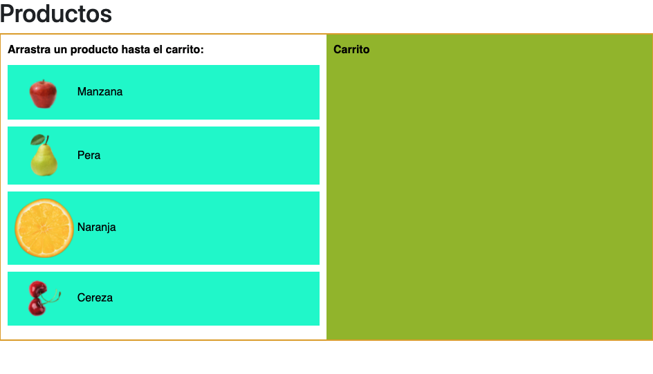
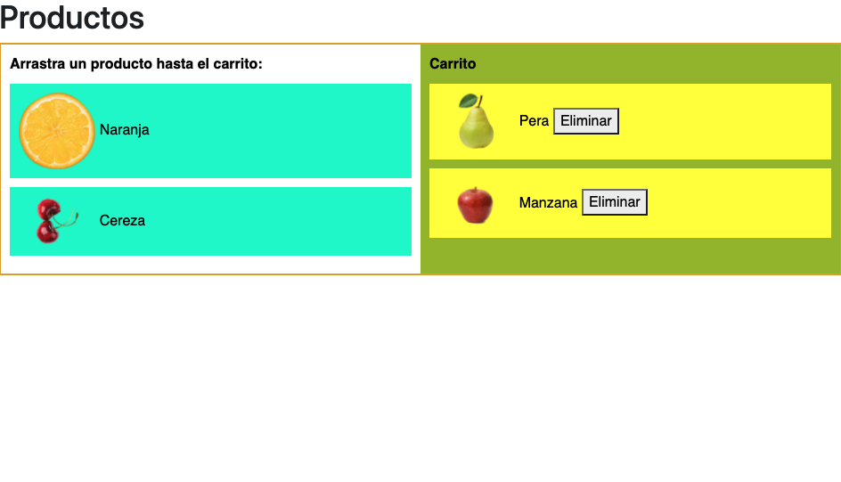

## Sobre el Proyecto

Reto 2 de drag and drop hecho con JS y HTML para el Bootcamp de Angular impartido por Geekshub. Un poco cutre pero la funcionalidad esta y funciona correctamente.
Me ha costado mucho trabajo la parte de JS ya que no lo conozco al 100% pero googleando todo se encuentra.

## License

Distributed under the MIT License. See `LICENSE` for more information.

## Contact

Sergio - sergio_boal@me.com

Project Link: [https://github.com/chalangui/Reto-2](https://github.com/chalangui/Reto-2)